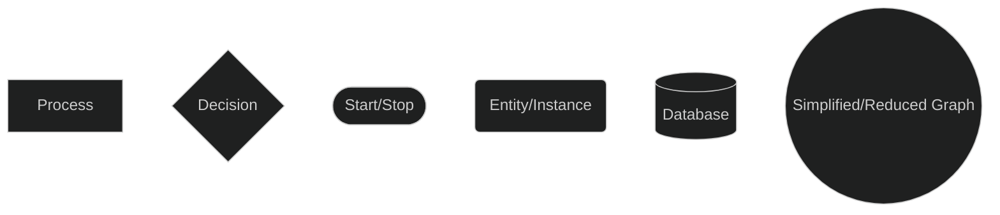
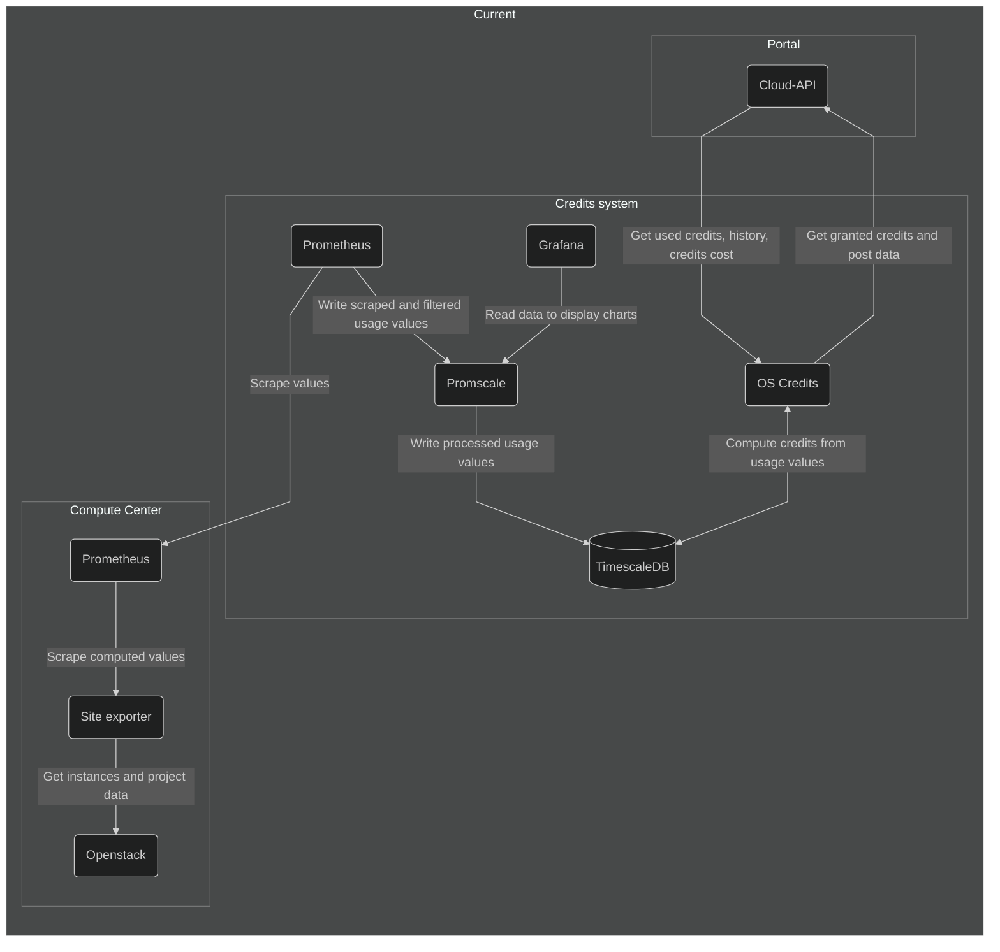
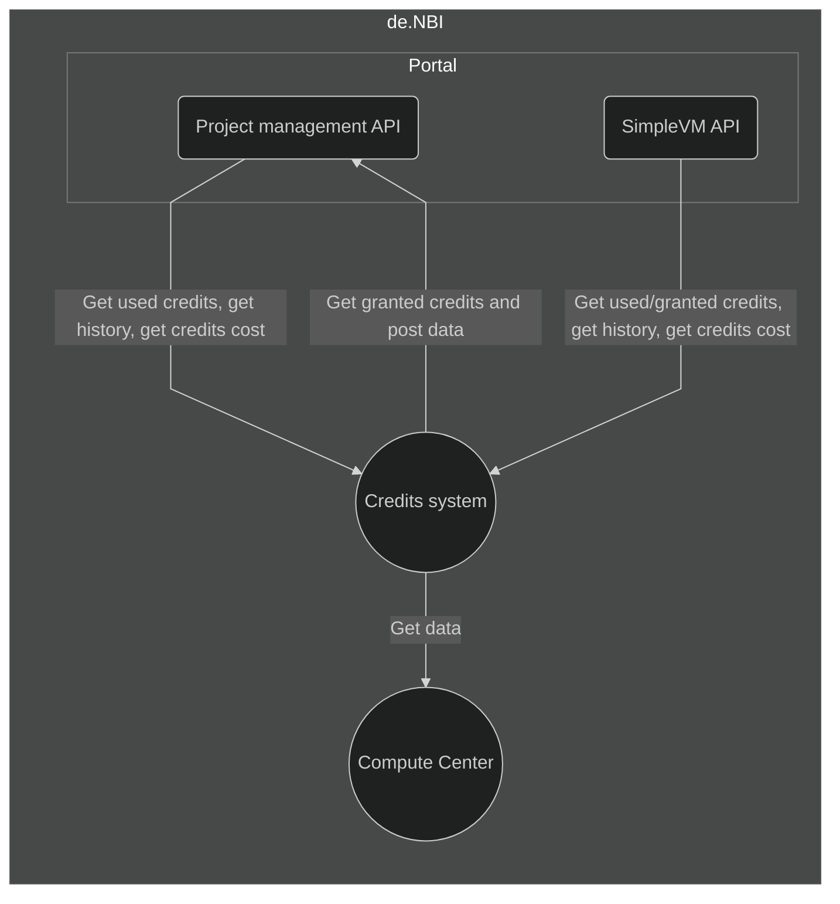
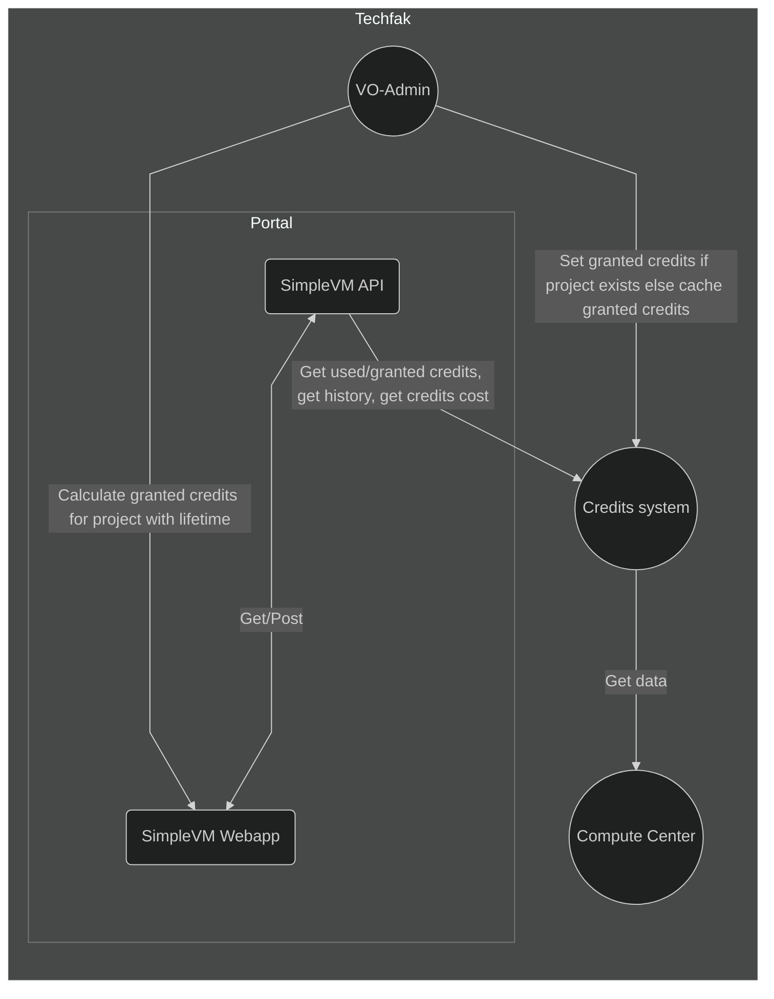

#Legend

```mermaid
%%{init: {'theme': 'dark', 'flowchart': {'curve':'linear'}}}%%
flowchart TB
  direction TB
  process[Process]
  if_clause{Decision}
  start([Start/Stop])
  entity(Entity/Instance)
  database[(Database)]
  simplified((Simplified/Reduced Graph))
```
#Current setup

```mermaid
%%{init: {'theme': 'dark', 'flowchart': {'curve':'linear'}}}%%
flowchart TB
  subgraph current [Current]
  direction TB
    subgraph site [Compute Center]
      direction TB
      openstack(Openstack)
      exporter(Site exporter)
      site_prometheus(Prometheus)
      exporter-->|Get instances and project data|openstack
      site_prometheus-->|Scrape computed values|exporter
    end
    
    subgraph credits_system [Credits system]
      direction TB
      credits(OS Credits)
      timescaledb[(TimescaleDB)]
      portal_prometheus(Prometheus)
      promscale(Promscale)
      portal_grafana(Grafana)
      portal_prometheus--->|Scrape values|site_prometheus
      portal_prometheus-->|Write scraped and filtered usage values|promscale
      promscale-->|Write processed usage values|timescaledb
      credits<-->|Compute credits from usage values|timescaledb
      portal_grafana-->|Read data to display charts|promscale
    end
    
    subgraph portal [Portal]
      direction TB
      project_api(Cloud-API)
      project_api--->|Get used credits, history, credits cost|credits
      credits--->|Get granted credits and post data|project_api
    end
  end

```
#Longterm de.NBI setup

```mermaid
%%{init: {'theme': 'dark', 'flowchart': {'curve':'linear'}}}%%
flowchart TB
  subgraph a [de.NBI]
    direction TB
    cc((Compute Center))
    credits((Credits system))
    credits-->|Get data|cc
  
    subgraph portal [Portal]
      direction TB
      project_api(Project management API)
      simplevm_api(SimpleVM API)
    end
    
    project_api--->|Get used credits, get history, get credits cost|credits
    credits-->|Get granted credits and post data|project_api
    simplevm_api-->|Get used/granted credits, get history, get credits cost|credits
  end

```
#Shortterm Techfak setup

```mermaid
%%{init: {'theme': 'dark', 'flowchart': {'curve':'linear'}}}%%
flowchart TB
  subgraph a [Techfak]
    direction TB
    cc((Compute Center))
    credits((Credits system))
    credits--->|Get data|cc
    user((VO-Admin))
  
    subgraph portal [Portal]
      direction TB
      simplevm_webapp(SimpleVM Webapp)
      simplevm_api(SimpleVM API)
      simplevm_api<--->|Get/Post|simplevm_webapp
    end
    
    simplevm_api-->|Get used/granted credits, get history, get credits cost|credits
    user-->|Set granted credits if project exists else cache granted credits|credits
    user----->|Calculate granted credits for project with lifetime|simplevm_webapp
  end
  
```
